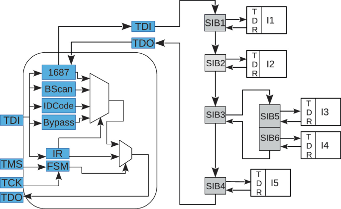
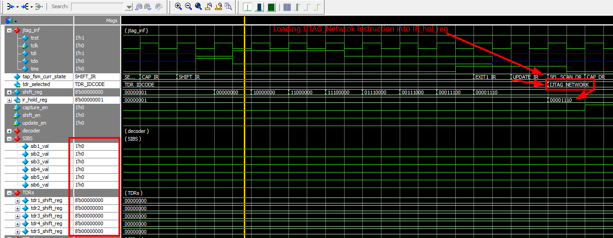
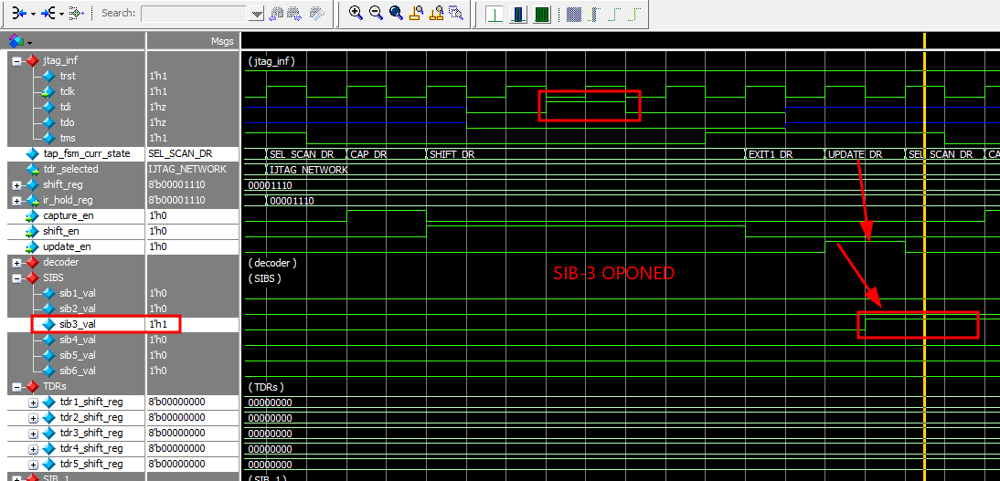
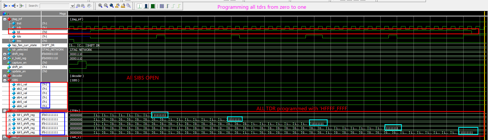

# IEEE 1687 IJTAG RTL Implementation


Synthesizable IEEE 1687 (IJTAG) RTL implementation in SystemVerilog featuring a hierarchical SIB network, reusable Test Data Registers (TDRs), and a complete simulation environment.

> This project builds upon my standalone IEEE 1149.1 JTAG implementation.  
> **JTAG Repository:** https://github.com/theuppercaseguy/JTAG-IEEE-1149.1-RTL/<jtag_repo>

---

# Table of Contents

- [Features](#features)
- [Repository Structure](#repository-structure)
- [IJTAG Network](#ijtag-network)
- [Implemented Modules](#implemented-modules)
- [Testbench](#testbench)
- [Simulation](#simulation)
- [Waveforms](#waveforms)
- [Configuration](#configuration)
- [Future Improvements](#future-improvements)
- [Author](#author)
- [License](#license)

---

# Features

- IEEE 1687 compliant Segment Insertion Bits (SIBs)
- Hierarchical IJTAG network
- Parameterizable Test Data Registers
- Generic reusable shift register
- Dynamic scan-chain insertion/removal
- Synthesizable RTL
- Complete QuestaSim simulation environment

---

# Repository Structure

```
IJTAG/
│
├── quest_simu/
│   ├── comp.do
│   ├── ijtag_wave.do
│   ├── modelsim.ini
│   ├── transcript
│   └── ...
│
├── rtl/
│   ├── bsc.sv
│   ├── file_list.f
│   ├── ijtag_network.sv
│   ├── ijtag_tb_top.sv
│   ├── ijtag_top.sv
│   ├── instr_decoder.sv
│   ├── instr_register.sv
│   ├── jtag_defines.svh
│   ├── jtag_interface.sv
│   ├── jtag_package.sv
│   ├── SIB.sv
│   ├── shift_register.sv
│   ├── TAP_FSM.sv
│   └── TDR.sv
│
└── README.md
```

---

# IJTAG Network

The implemented network consists of

- 6 Segment Insertion Bits (SIBs)
- 5 Instrument Test Data Registers (TDRs)
- One nested IJTAG segment
- Dynamically configurable scan paths

<p align="center">

</p>

---

# Implemented Modules

| Module | Description |
|---------|-------------|
| TAP FSM | IEEE 1149.1 TAP Controller |
| Instruction Register | IR Shift & Hold Register |
| Instruction Decoder | JTAG Instruction Decoder |
| Shift Register | Generic serial/parallel shift register |
| SIB | IEEE 1687 Segment Insertion Bit |
| TDR | Generic Instrument Register |
| IJTAG Network | Hierarchical scan network |

---

# Testbench

The supplied testbench demonstrates a complete IJTAG programming sequence:

1. Reset TAP
2. Load IJTAG instruction into IR
3. Open parent SIB
4. Open remaining SIBs
5. Shift data through all TDRs
6. Return to Run-Test/Idle

The testbench uses a reusable `jtag_cycle()` task to accurately drive `TMS` and `TDI` on JTAG clock boundaries.

---

# Simulation

### Compile

```bash
cd quest_simu
vsim -do comp.do
```

or manually

```tcl
vlib work
vmap work work

vlog -mfcu -f ../rtl/file_list.f
vopt ijtag_tb_top -o ijtag_tb_opt +acc
vsim -l sim.log -wlf sim.wlf ijtag_tb_opt

do ijtag_wave.do
run -all
```

---

# Waveforms

### Loading IJTAG_Network Instruction 

<p align="center">

</p>

---

### Programing SIB-3 to Open
we do this so we can open SIB-5 and SIB-6 withought going through SIB 1, 2, 4 TDR's. Essentially saving (8*3) 24 clks. 

<p align="center">

</p>

---

### Programing all SIB's to Open

<p align="center">

</p>

---

### Writing 'HFFF_FFFF to All TDR's

<p align="center">

</p>

---

# Configuration

Each TDR can be independently configured.

```systemverilog
`define TDR1_WIDTH      8
`define TDR2_WIDTH      8
`define TDR3_WIDTH      8
`define TDR4_WIDTH      8
`define TDR5_WIDTH      8
```

Reset values are also configurable through `jtag_defines.svh`.

---

# Future Improvements

- IEEE 1687 ICL support
- IEEE 1687 PDL examples
- More complex instrument networks
- UVM Verification Environment
- Assertions and Functional Coverage

---

# Author

**Saad Khan**

GitHub: https://github.com/theuppercaseguy <br>
Portfolio: https://portfolio-saadkhan.vercel.app/<br>
LinkedIn: https://www.linkedin.com/in/the-guy/<br>

---

# License

This project is open for educational, research, and commercial use.

Please provide attribution by referencing this repository if you use or modify this work.
